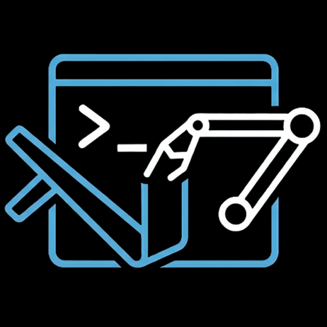

# VS Code Terminal MCP 

[](https://marketplace.visualstudio.com/items?itemName=davidrsch.terminal-automatization)
[](https://open-vsx.org/extension/davidrsch/terminal-automatization)
[](https://github.com/davidrsch/vscode_terminal_automatization/actions/workflows/ci.yml)

A VS Code extension that exposes an **MCP (Model Context Protocol) server** so AI assistants can **list, rename, navigate, create, close, split, and execute commands** in your VS Code terminals — using the real VS Code API, not browser automation.

## Why this extension?

No existing MCP server provides first-class terminal management inside VS Code. This extension bridges that gap by running a Streamable HTTP MCP server directly inside the VS Code extension host, giving AI agents direct access to `vscode.window.terminals`.

## Tools

| Tool                    | Description                                                                                 |
| ----------------------- | ------------------------------------------------------------------------------------------- |
| `list_terminals`        | List all open terminals with index, name, active status, and shell integration availability |
| `get_active_terminal`   | Get info about the currently focused terminal                                               |
| `focus_terminal`        | Focus (show) a terminal by name or index                                                    |
| `create_terminal`       | Create a new terminal with optional name, cwd, and shell path                               |
| `rename_terminal`       | Rename a terminal by name or index                                                          |
| `close_terminal`        | Close (dispose) a terminal by name or index                                                 |
| `send_text_to_terminal` | Send text/command to a terminal, optionally pressing Enter                                  |
| `split_terminal`        | Split a terminal pane from an existing terminal                                             |
| `hide_terminal`         | Hide (collapse) a terminal panel without closing it                                         |
| `close_all_terminals`   | Close all open terminals at once                                                            |
| `run_command`           | Run a shell command and capture output (requires shell integration, VS Code 1.93+)          |

## Installation

### VS Code Marketplace

[](https://marketplace.visualstudio.com/items?itemName=davidrsch.terminal-automatization)

or search **"Terminal MCP"** in the Extensions view (`Ctrl+Shift+X`).

### Open VSX

[](https://open-vsx.org/extension/davidrsch/terminal-automatization)

### From VSIX

```sh
code --install-extension terminal-automatization-*.vsix
```

## Setup

Once installed, the extension:

1. Starts an MCP Streamable HTTP server — by default the **OS picks a free port** (port `0`), so there are never port conflicts.
2. Shows the actual port in the status bar — click it for quick actions.
3. Can optionally auto-configure `.vscode/mcp.json` for your MCP client.

### Manual MCP configuration

If you need a fixed port, set `terminalMcp.port` in your settings, then add to `.vscode/mcp.json`:

```json
{
  "servers": {
    "terminal-automatization": {
      "type": "http",
      "url": "http://localhost:<PORT>/mcp"
    }
  }
}
```

Replace `<PORT>` with the port shown in the status bar, or your configured port.

## Configuration

| Setting                            | Default | Description                                                                                      |
| ---------------------------------- | ------- | ------------------------------------------------------------------------------------------------ |
| `terminalMcp.port`                 | `0`     | HTTP server port (`0` = OS picks a free port). Set a fixed port for external MCP clients.        |
| `terminalMcp.enableHttpServer`     | `true`  | Start the HTTP server. Disable if you only use VS Code's built-in MCP — frees the port entirely. |
| `terminalMcp.autoConfigureMcpJson` | `false` | Auto-add entry to `.vscode/mcp.json` on startup.                                                 |

## Commands

| Command                                 | Description                          |
| --------------------------------------- | ------------------------------------ |
| `Terminal MCP: Show Status`             | Show server status and quick actions |
| `Terminal MCP: Copy MCP Configuration`  | Copy JSON config to clipboard        |
| `Terminal MCP: Add to .vscode/mcp.json` | Write config to workspace mcp.json   |
| `Terminal MCP: Restart Server`          | Restart the MCP server               |

## Requirements

- VS Code `1.99.0` or higher
- For `run_command` output capture: VS Code 1.93+ with shell integration enabled

## License

MIT
